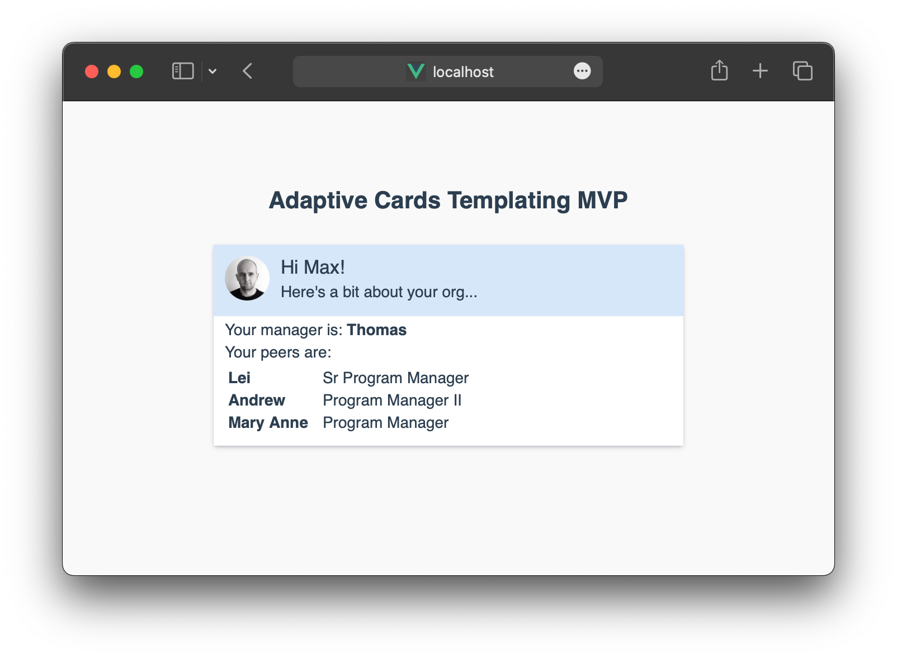

# adaptive-cards-mvp



Simple implementation of Adaptive Cards Templating in Vue.js (https://learn.microsoft.com/en-us/adaptive-cards/templating/)

---

###### EmployeeCardTemplate.json

``` json
{
    "type": "AdaptiveCard",
    "version": "1.0",
    "body": [
        {
            "type": "ColumnSet",
            "style": "accent",
            "bleed": true,
            "columns": [
                {
                    "type": "Column",
                    "width": "auto",
                    "items": [
                        {
                            "type": "Image",
                            "url": "${photo}",
                            "altText": "Profile picture",
                            "size": "Small",
                            "style": "Person"
                        }
                    ]
                },
                {
                    "type": "Column",
                    "width": "stretch",
                    "items": [
                        {
                            "type": "TextBlock",
                            "text": "Hi ${name}!",
                            "size": "Medium"
                        },
                        {
                            "type": "TextBlock",
                            "text": "Here's a bit about your org...",
                            "spacing": "None"
                        }
                    ]
                }
            ]
        },
        {
            "type": "TextBlock",
            "text": "Your manager is: **${manager.name}**"
        },
        {
            "type": "TextBlock",
            "text": "Your peers are:"
        },
        {
            "type": "FactSet",
            "facts": [
                {
                    "$data": "${peers}",
                    "title": "${name}",
                    "value": "${title}"
                }
            ]
        }
    ]
}
```

---

##### EmployeeData.json

``` json
{
  "name": "Max",
  "photo": "https://lh3.googleusercontent.com/a-/ACNPEu-arr7NVIAQEeZkduvv7xhLl69btt2OSr8bawNp",
  "manager": {
    "name": "Thomas",
    "title": "PM Lead"
  },
  "peers": [
    {
      "name": "Lei",
      "title": "Sr Program Manager"
    },
    {
      "name": "Andrew",
      "title": "Program Manager II"
    },
    {
      "name": "Mary Anne",
      "title": "Program Manager"
    }
  ]
}

```

---

## Project setup
```
yarn install
```

### Compiles and hot-reloads for development
```
yarn serve
```

### Compiles and minifies for production
```
yarn build
```

### Lints and fixes files
```
yarn lint
```
